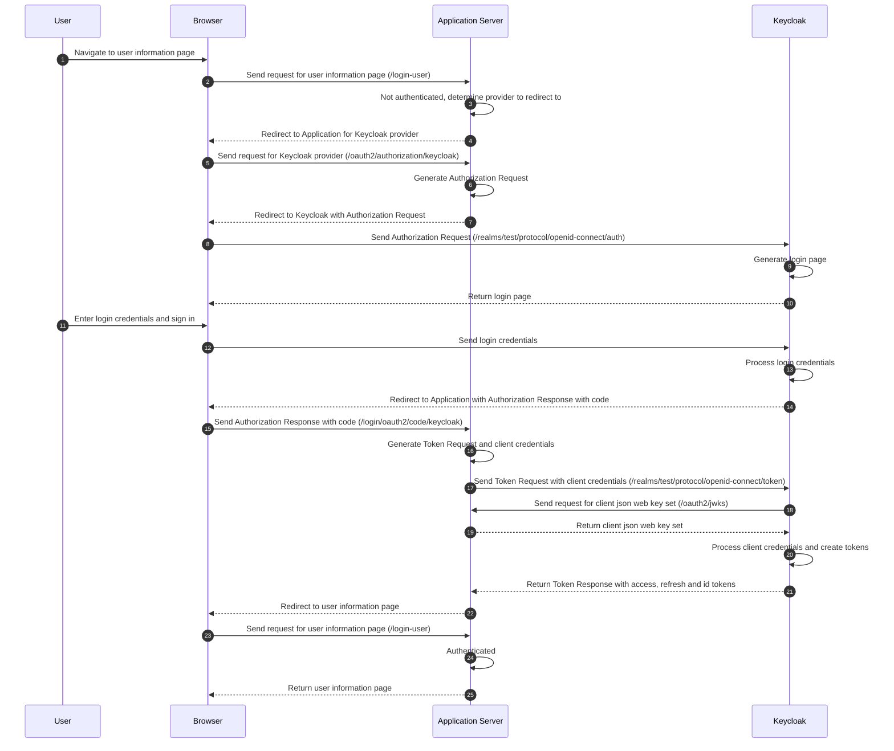

# Spring Boot Example OpenID Connect Relying Party for Keycloak

This project is an example implementation of a OpenID Connect Relying Party built using Spring Boot and Spring Security OAuth2 Client.

[Keycloak](https://github.com/keycloak/keycloak) is used as the public Identity Provider for testing purposes

## Quick Start

### Configuring Keycloak as the Identity Provider

The Spring Boot application exposes its JWKS at http://localhost:8081/oauth2/jwks

Start Keycloak

```shell
kc start-dev
```

Access Keycloak at http://localhost:8080/

* Create an administrative user
* Login to the administrative console
* Create the `test` realm
  * Click on the `Keycloak` dropdown on the left navigation bar
  * Select `Create Realm`
  * Set `test` as the `Realm name` and click on `Create`
* Create the `keycloak-spring-boot-example` client
  * Click on `Clients` on the left navigation bar
  * Click on `Create client`
  * Set `keycloak-spring-boot-example` as the `Client ID` and click on `Next`
  * Toggle `Client authentication` to `On` and click on `Next`
  * Set `http://localhost:8081/*` as `Valid redirect URIs`, `Valid post logout redirect URIs` and `Web origins` and click on `Save`
  * Under `Logout settings` 
    * Toggle `Front channel logout` to `Off`
    * Set `http://localhost:8081/logout/connect/back-channel/keycloak` as `Backchannel logout URL` and click on `Save`
  * Click on `Credentials`
  * Click on the `Client Authenticator` dropdown and select `Signed Jwt` and click on `Save`
  * Click on `Keys`
  * Toggle `Use JWKS URL` to `On` and enter `http://localhost:8081/oauth2/jwks` as the `JWKS URL` and click on `Save`
* Allow user registrations
  * Click on `Realm settings` on the left navigation bar
  * Click on `Login`
  * Toggle `User registration` to `On`

### Installing and running the Relying Party Spring Boot application

```shell
mvn spring-boot:run
```

### Testing the example Relying Party

| Description                   | Endpoint
|-------------------------------|-----------------------------------------------------
| Access the application        | http://localhost:8081/login-user
| Logout from the application   | http://localhost:8081/logout
| View the public keys          | http://localhost:8081/oauth2/jwks
| Access Keycloak user account  | http://localhost:8080/realms/test/account
| Logout from Keycloak          | http://localhost:8080/realms/test/protocol/openid-connect/logout

## Integration Details

Note that this example does not securely store the private keys which are located in `src/main/resources/jwks.json`. This should be securely stored and rotated, for instance on AWS this should be stored in AWS Secrets Manager with a Secrets Manager Rotation Lambda. This can be configured in Spring using [Spring Cloud AWS Secrets Manager](https://github.com/awspring/spring-cloud-aws).

### Json Web Key Sets

Keycloak will call the endpoint http://localhost:8080/oauth2/jwks in order to get the public keys of the application
* The public verification key used for Mockpass to verify the signature for the `private_key_jwt` client assertion

The `JWKSet` `@Bean` used by the application is produced in `WebSecurityConfiguration` and its public keys are exposed using the `@RestController` `JwksController`. Note that `JWKSet.toString()` removes the private components of the keys.

### Client Authentication

Keycloak was configured to use `private_key_jwt` client authentication by setting `Signed Jwt` as the `Client Authenticator`.

Spring needs to be configured to use this client authentication method, and the token response client needs to be configured to use the appropriate private key to perform the signing.

```yaml
spring:
  security:
    oauth2:
      client:
        registration:
          keycloak:
            client-id: keycloak-spring-boot-example
            client-authentication-method: private_key_jwt
            authorization-grant-type: authorization_code
            scope:
            - openid
```

The `DefaultAuthorizationCodeTokenResponseClient` is used with the `NimbusJwtClientAuthenticationParametersConverter` configured with the private key and `NimbusJwtClientAuthenticationParametersConverter` used to customize the claims and headers on the client assertion.

### OpenID Connect Relying Party Initiated Logout

Spring supports the use of the `end_session_endpoint` to inform Keycloak that the user is being logged out. This is done by configuring a `OidcClientInitiatedLogoutSuccessHandler` as the logout success handler. Upon logout success this will redirect the browser to the `end_session_endpoint` with the `id_token_hint` set. Keycloak will then redirect the browser back to the application using the `post_logout_redirect_uri`.

### OpenID Connect Back Channel Logout

Spring supports receiving back channel logout requests from Keycloak if the user logs out from Keycloak.

```java
http.oidcLogout(oidcLogout -> oidcLogout.backChannel(withDefaults()));
```

The client on Keycloak needs to be configured to
* Toggle `Front channel logout` to `Off`
* Set `http://localhost:8081/logout/connect/back-channel/keycloak` as `Backchannel logout URL`

Where `keycloak` corresponds to the client registration id.

## Flow

